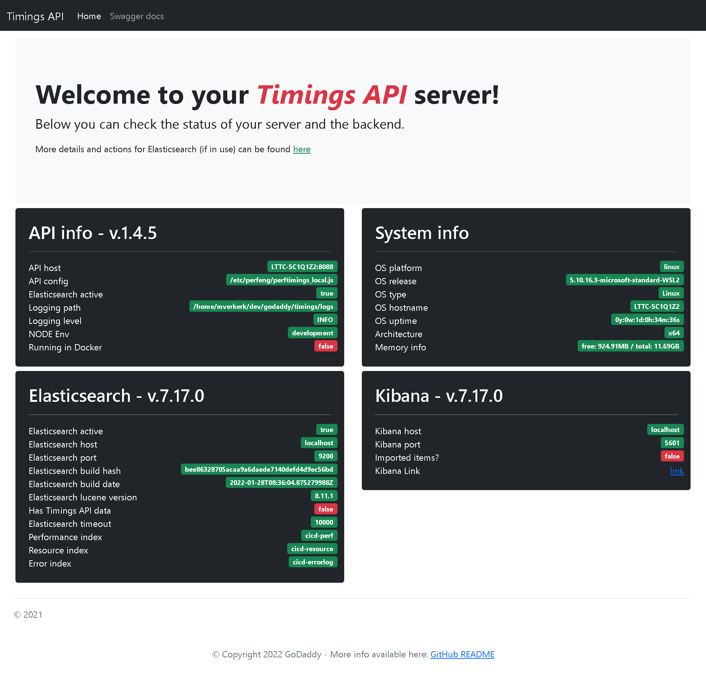

# UPDATING TIMINGS-DOCKER

## Intro

To make use of the latest features offered in the Elasticsearch/Kibana stack, the timings-docker repo will be updated from time to time. As part of these updates, the "major" version of Elasticsearch and Kibana might be updated and there is a chance that your existing data needs to be migrated. You may be doing an update of this repo and not realize that the version of Elasticsearch and Kibana have been upgraded.

Older versions of this repo did not have specific versions of Elasticsearch and Kibana pinned in the main docker-compose YML file and therefore, **your current data may have have been created by elasticsearch v5.x or v6.x**!

Running the latest Docker containers with older data **can cause issues or even data loss**!

This document is meant to help you through the migration.

## Upgrading Elasticsearch and Kibana

Assumption is that you have cloned/updated the latest version of this repo to a local directory on your Docker host

> **DO NOT RUN THE UPDATED TIMINGS-DOCKER JUST YET!!**

The current version of this repo has a new `/upgrade` folder where you can go through the (painful) process of migrating Elasticsearch and Kibana from one major version to the next.

> **IMPORTANT: it is NOT recommended that you skip a major version as you migrate your data!** Always migrate from v5.x to v6.x to v7.x and (soon) to v8.x!

### Upgrading v5.x to v6.x

=> Follow instructions here: [UPDATING from 5 to 6](./UPDATING_5_to_6.md)

### Upgrading v6.x to v7.x

=> Follow instructions here: [UPDATING from 6 to 7](./UPDATING_6_to_7.md)

## Restarting the API

After successfully migrating your Elasticsearch and Kibana data, you can restart the API by following these steps:

- **step 1**
  - Stop your current docker-compose environment
- **step 2**
  Remove the old `nodes` directory from `./elasticsearch/data`
- **step 3**
  Copy the entire content of `./upgrade/data_v7` to `./elasticsearch/data` (this is assuming that you followed the previous upgrade steps)
- **step 4**
  You can now start your regular docker-compose enviroment by running the following command from the `timings-docker` folder:

  ```bash
  $ docker-compose up --remove-orphans
  ```

## Check out your upgraded API

If all went well, you should have a fresh new API running at the same endpoints as before:

- The API should be at `http://{your_host}`
- Elasticseach at `http://{your_host}:9200`
- Kibana at `http://{your_host}:5601`

The latest release of the timings-api v2.x now offers a nice UI where you can check on the status of your API, Elasticsearch and Kibana.

Previous versions of the API only offered a swagger UI at the default address `http://{your_host}` but now you will see the new UI where you can also import sample data, Kibana items and view/edit your config settings!

Here's a quick peek of the new landing page:


