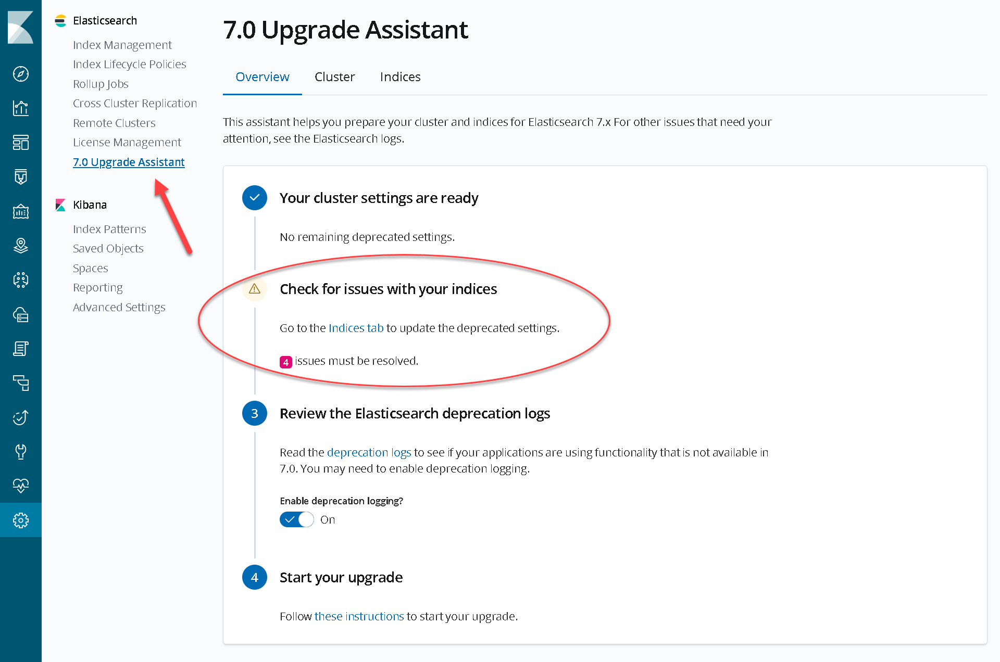
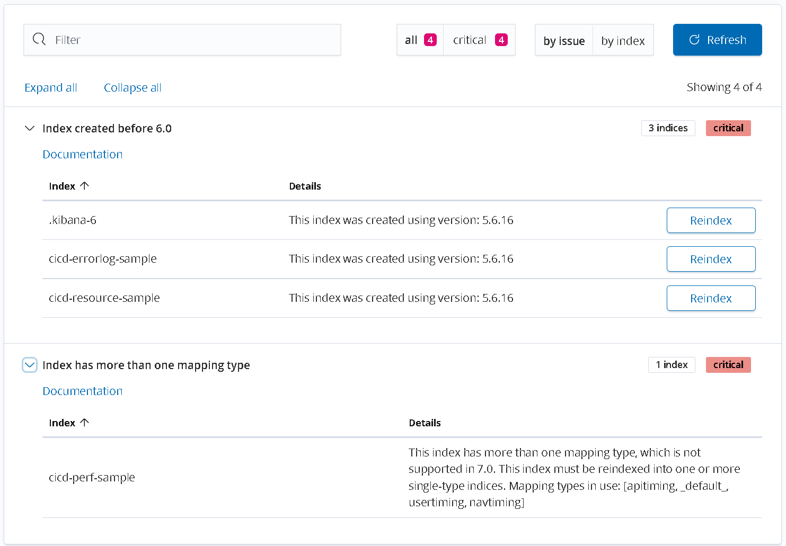
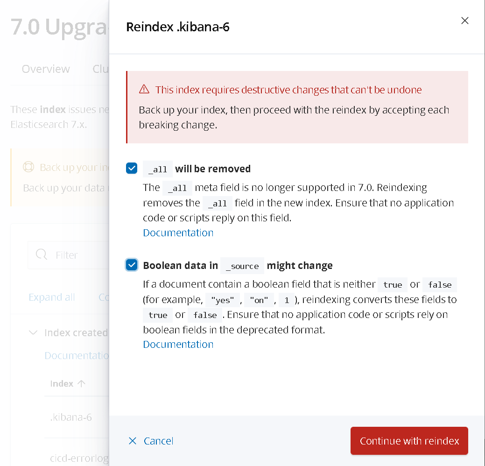
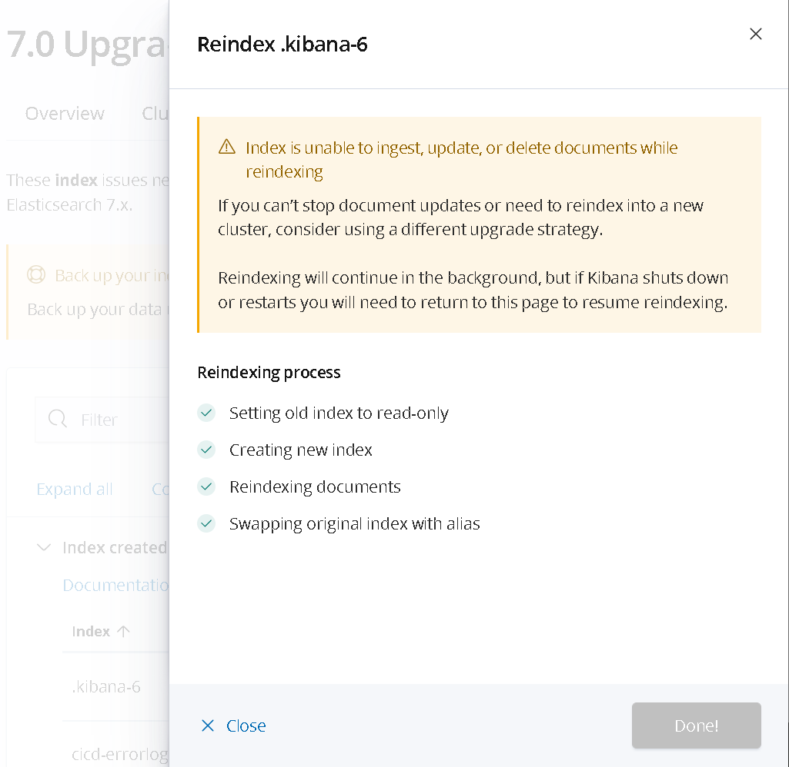
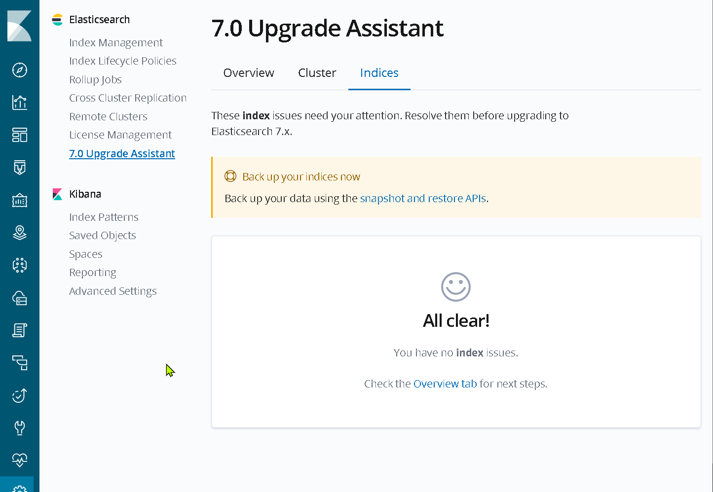

# Upgrading from v6.x to v7.x

Thankfully, the great folks at Elastic introduced the "Upgrade Assistent" in version 6.8 which will make this migration a lot easier!

## You will be performing the first steps in your current v6.x version of Kibana


## The Upgrade Assitent

In Kibana (we're still in v6), navigate to **Management > 7.0 Upgrade Assistant**

### The Overview tab

On the overview tab, you will see all the issues that you have to fix before you can upgrade to version 7.x



In this example, there are 4 issues to be resolved in the Index Settings! Click on the **Indices tab** to continue ...

### The Indices tab

You now get an overview of indices that need to be fixed before the upgrade:



#### Reindexing

In the example above, there are 3 indices that need reindexing. The process is pretty straightforward:

- Click on Reindex button - you will now see the Reindex slide-out:



- Select any checkboxes and click on "Continue with reindex"
- Click on "Reindex now"
- Wait for the Reindexing to complete



Repeat these steps for all the indcies that need reindexing and close the Reindex slide-out.

#### Fix "multi-type" issues

In the example, the `cicd-perf-sample` index has a "multi-type" issue that needs to be fixed. This can be achieved with the Reindexing steps listed below

For more information on Reindexing: [Elasticsearch 6.8 Reindex reference](https://www.elastic.co/guide/en/elasticsearch/reference/6.8/docs-reindex.html)

> NOTE: the example is not processing the [cicd-perf-sample] index but the [cicd-perf*] indices which is most likely your scenario...

- **step 1** - Update the [cicd-perf] template

  Run the following two commands:

  ```no-lang
  DELETE _template/cicd-perf
  ```

  ```no-lang
  PUT _index_template/cicd-perf?include_type_name=true
  {
    "version": 145,
    "index_patterns": [
      "cicd-perf-*",
      "cicd-resource-*",
      "cicd-errorlog-*"
    ],
    "template": {
      "settings": {
        "index": {
          "refresh_interval": "30s",
          "number_of_shards": "1",
          "number_of_replicas": "1"
        }
      },
      "mappings": {
        "dynamic_date_formats": [
          "strict_date_optional_time",
          "yyyy/MM/dd HH:mm:ss Z||yyyy/MM/dd Z"
        ],
        "dynamic": true,
        "_source": {
          "excludes": [],
          "includes": [],
          "enabled": true
        },
        "date_detection": true,
        "dynamic_templates": [
          {
            "string_fields": {
              "mapping": {
                "norms": false,
                "ignore_above": 512,
                "index": true,
                "store": false,
                "type": "keyword"
              },
              "match_mapping_type": "string",
              "match": "*"
            }
          },
          {
            "long_fields": {
              "mapping": {
                "store": false,
                "type": "long"
              },
              "match_mapping_type": "long",
              "match": "*"
            }
          }
        ],
        "_meta": {
          "api_version": 145
        }
      }
    }
  }
  ```

- **step 2** - Reindex the [cicd-perf-*] indices

  > This process can take a VERY long time, depending on the amount of data in your indices!

  Run the following command:

  ```no-lang
  POST _reindex
  {
    "source": {
      "index": "cicd-perf-*"
    },
    "dest": {
      "index": "cicd-perf"
    },
    "script": {
      "lang": "painless",
      "source": "ctx._index = 'cicd-perf-' + (ctx._index.substring('cicd-perf-'.length(), ctx._index.length())) + '-1'"
    }
  }
  ```

- **step 3** - Delete the old [cicd-perf-*] indices
  
  After successful Reindexing in step-2, you can now safely delete your old indices:

  ```no-lang
  DELETE cicd-perf-*
  ```

After running these steps, you can go back to the Upgrade assistant and, if all went well, you should now see the "All Clear" screen:



## [OPTIONAL] Check the migration in Elasticsearch and Kibana v7

At this point in the process, you are still running version 6! If you first want to make sure that you can now run the data with Elastic v7, follow these steps:

- **step 1**
  - Stop your current docker-compose environment
- **step 2**
  - Copy the entire `nodes` folder from `./upgrade/data_v6` to `./upgrade/data_v7`
- **step 3**
  - To prevent any file level permissions issues, set full permissions on the `./upgrade/data_v7` directory:

  ```bash
  $ sudo chown -R $USER:$USER ./upgrade/data_v7
  $ sudo chmod 777 -R ./upgrade/data_v7
  ```

- **step 4**
  - Start up an Elasticsearch/Kibana v7.x environment by running the following command from the `timings-docker` folder:

  ```bash
  $ docker-compose -f ./upgrade/docker-compose-elk-v7.yml up --remove-orphans
  ```

  > Note: this runs Elasticsearch and Kibana (version 7.17.0) WITHOUT the timings API!

- **step 5**
  - After Elasticsearch and Kibana have fully started (and your data has been migrated), you can navigate to Kibana at `http://{your_host}:5601` and check that everything looks OK:
    - You can use the Discover feature to see if your data looks OK
    - You can use the Dashboards feature to see if your visualizations look OK

## Next steps

Almost there! You can now go back to the main document to finish the process

**=> next step: RESTART TIMINGS-API ... you can follow the last steps here:** [UPDATING](./UPDATING.md#check-out-your-upgraded-api)
